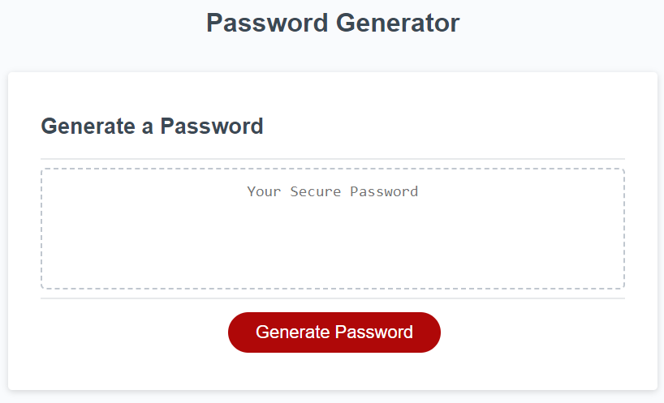

# password-generator

## Description
I was challeneged to produce a random password generator that was based on user input selections of a length between 10-64 characters and whether the user wanted the password to contain lowercase characters, uppercase characters, numeric characters and/or special characters. 

https://jc6991.github.io/password-generator/

## Table of Contents
- [Installation](#Installation)
- [Usage](#Usage)
- [Credits](#Credits)
- [License](#License)

## Installation
N/A

## Usage
The user should click on the "Generate Password" button as shown below.

Upon clicking the "Generate Password" button, the user will be prompted to enter a value between 10 and 64. This represents the length of the random password.

If the user enters a value that is out of the range or a non-numerical value, an alert will be displayed, like below, informing the users choice is invalid.

After specifying a valid input for the password length, the user will be faced with the following 4 choices:

Clicking "OK" will confirm the users choice to include the relevant current option in the final password.

Clicking "Cancel" will confirm the users choice to not include the current option in the final password.

An example of a random password after selecting a length of 20 characters and including all options, is shown below.

## Credits
N/A

## License
Please refer to the LICENSE in the repo.